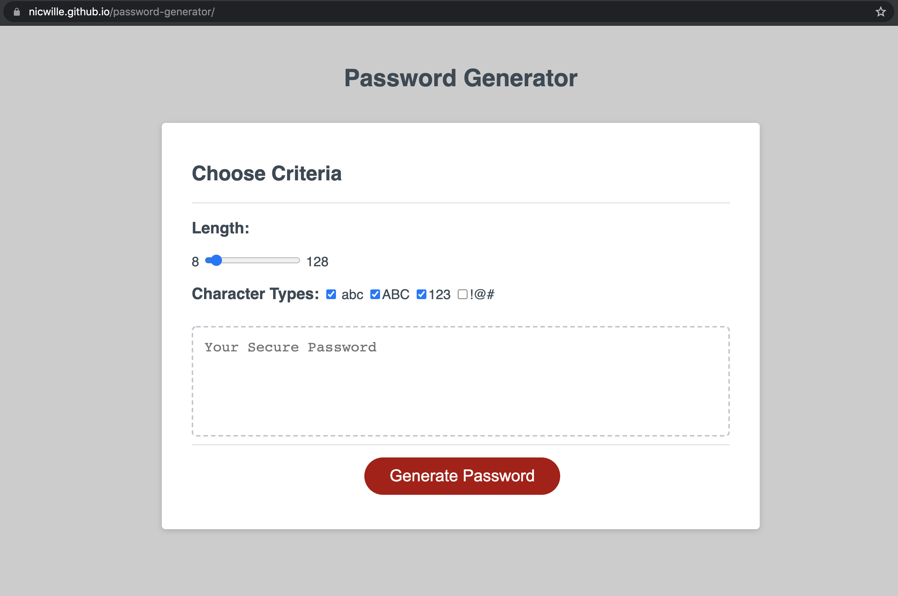

#   PASSWORD GENERATOR

##  script.js 

preffered UX. user checks boxes and uses scroll bar(initial value @16). 

##  script2.js

gives the user a series of prompts, after which the [GENERATE PASSWORD] button can be pressed to display a random password within thier requirements (ignore checkboxes and scroll bar)

### Built with:

- html
- css 
- javascript
- web api

### website

https://nicwille.github.io/password-generator/

### Contribution
Made with ❤️ by Nic Wille

## Image of website

